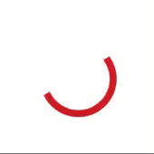
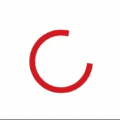

# BAProgressHUD

BAProgressHUD is a progress animation that easy to use displaying on progress.

   

## Requirements

* iOS 10.3+

## Installation

```
pod 'BAProgressHUD'
```

## Usage

Import BAProgressHUD

```swift
import BAProgressHUD
```
Show the progress HUD
```swift
let baProgressHUD = BAProgressHUD()
baProgressHUD.show(in: self.view)
```
You can use second style like that
```swift
let baProgressHUD = BAProgressHUD(style: .second)
baProgressHUD.show(in: self.view)
```
Show the progress HUD after delay
```swift
baProgressHUD.showAfterDelay(in: self.view, delay: 2)
```
Show the progress HUD with background view
```swift
baProgressHUD.showWithBackgroundView(in: self.view)
```
Show the progress HUD with background view after delay
```swift
baProgressHUD.showAfterDelayWithBackgroundView(in: self.view, delay: 1)
```
Hide the progress HUD
```swift
baProgressHUD.hide()
```
Hide the progress HUD after delay
```swift
baProgressHUD.hideAfterDelay(delay: 3)
```

## Customization
BAProgressHUD can be customized with the following methods:
```swift
baProgressHUD.setDuration(duration: 0.8)
baProgressHUD.setColor(color: .orange)
baProgressHUD.setLineCap(lineCap: .round)
baProgressHUD.setBackgroundViewColor(color: .red)
baProgressHUD.setBackgroundViewAlpha(alpha: 0.7)
```

